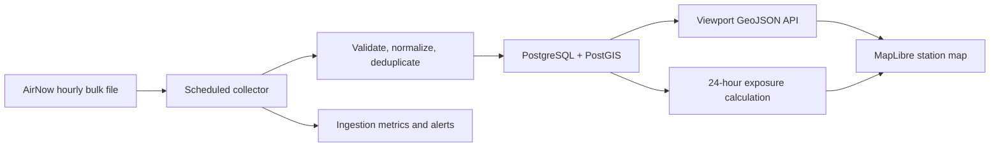

# AQI-to-Cigarette-Equivalent Map: Implementation Plan

Status: core Vercel Hobby MVP implemented and verified
Prepared: July 16, 2026

Implementation note: the free-tier build uses plain latitude/longitude columns
in Neon Postgres and bounded SQL queries instead of PostGIS or an ORM. This
keeps setup small and portable on Vercel Hobby. City/ZIP search, global OpenAQ
coverage, and launch-scale alerting remain later roadmap items; browser
geolocation, the North American map, hourly collection, history, and health
reporting are implemented.

## 1. Outcome

Build a responsive web application that:

1. Collects current, monitor-level air-quality observations on an hourly schedule.
2. Displays current **PM2.5 NowCast AQI** readings on a map.
3. Translates the underlying raw PM2.5 concentration into a clearly labeled, rough **cigarette-equivalent air-pollution estimate**.
4. Preserves the original source values, timestamps, agency attribution, and preliminary-data status.

The MVP should cover the United States, Canada, and parts of Mexico using EPA AirNow. The architecture should allow a global OpenAQ adapter later.

The product must not say that a user “smoked” or “consumed” cigarettes. It is a population-level health-impact analogy, not a personal dose or medical-risk calculation.

## 2. Recommended MVP scope

### In scope

- A North American station map using the latest AirNow hourly observations.
- Colored, clustered monitor markers showing PM2.5 NowCast AQI.
- A location/monitor detail card with:
  - monitor name and location;
  - PM2.5 NowCast AQI and EPA category;
  - raw hourly PM2.5 concentration in µg/m³;
  - a projected 24-hour cigarette-equivalent rate;
  - a trailing 24-hour accumulated equivalent when the stored data are sufficiently complete;
  - observation time, age, source agency, and preliminary-data label.
- Map modes for “PM2.5 AQI” and “Cigarette equivalent.”
- “Use my location,” AQI legend, methodology panel, and source attribution.
- A scheduled data collector, persistent observation history, stale-data handling, monitoring, and automated tests.
- Responsive desktop and mobile layouts, plus a non-map list/table alternative.

### Explicitly out of scope for the MVP

- Personalized exposure or medical advice.
- Claims that cigarette smoke and ambient pollution are chemically identical.
- Converting the overall AQI number—or ozone, NO2, CO, SO2, or PM10—into cigarettes.
- Forecasts, alerts, accounts, saved places, push notifications, indoor-air estimates, or route exposure.
- An interpolated heatmap. Station markers are more honest because monitors do not measure the space between them.
- A global “official AQI.” AQI standards differ by country, and OpenAQ supplies physical measurements rather than a universal official index.

## 3. Product decisions

| Decision | MVP choice | Reason |
|---|---|---|
| Geographic coverage | AirNow coverage: US, Canada, and parts of Mexico | Best combination of official AQI, raw PM2.5, coordinates, and provenance in one hourly bulk file. |
| Map metric | PM2.5 NowCast AQI | It is source-supplied, current, and directly related to the PM2.5 value used for the analogy. |
| Map geometry | Monitor points with clustering | Avoids implying measured conditions between monitors. |
| Cigarette input | Raw hourly PM2.5 in µg/m³ | AQI is unitless, nonlinear, and may be driven by another pollutant. |
| Current estimate wording | “≈ X cigarette-equivalents/day if this outdoor level persisted for 24 hours” | Makes the time assumption explicit and avoids presenting an hourly reading as actual daily exposure. |
| Historical estimate | Integrate raw hourly PM2.5 values | NowCast values overlap multiple hours and must not be summed. |
| Primary data store | Neon PostgreSQL with latitude/longitude indexes | Reliable deduplication/history and bounded viewport queries without a paid extension requirement. |
| Map renderer | MapLibre GL JS with a production tile provider | Supports GeoJSON, clustering, data-driven styling, and provider independence. |

## 4. Data source

### MVP: AirNow Hourly AQ Obs bulk file

Use `HourlyAQObs_YYYYMMDDHH.dat`, documented in the [AirNow Hourly AQ Obs specification](https://docs.airnowapi.org/docs/HourlyAQObsFactSheet.pdf).

The file is produced approximately 35 minutes after each hour and contains, per monitor:

- station ID, name, latitude, and longitude;
- UTC observation date/time and reporting agency;
- NowCast AQI for PM2.5, PM10, and ozone, plus hourly NO2 AQI;
- raw hourly concentrations for PM2.5, PM10, ozone, NO2, CO, and SO2;
- units and reporting-area metadata.

AirNow updates files from the preceding 72 hours as late data and corrections arrive. The collector therefore needs both a fast current import and a reconciliation pass.

AirNow data are preliminary and not fully validated. Keep source values unchanged, retain the originating agency, display the preliminary-data notice, and separate derived fields from source fields. Review the [AirNow Data Use Guidelines](https://docs.airnowapi.org/docs/DataUseGuidelines.pdf) and contact the AirNow Data Management Center before a public launch because this application creates a derived interpretation.

### Global expansion: OpenAQ v3

Add a provider adapter after the North American MVP. OpenAQ offers global, near-real-time measurements in physical units, but does not provide AQI and does not cover every monitor. Its hosted API currently requires a key and allows 60 requests/minute and 2,000/hour. Each upstream provider can have its own license and attribution requirements.

For global points:

- ingest raw PM2.5 and location/license metadata centrally;
- prefer direct AirNow records inside AirNow coverage to avoid duplicates re-exported through OpenAQ;
- only show a computed PM2.5 AQI when enough hourly data exist to apply the chosen standard correctly;
- otherwise show “PM2.5 concentration” rather than calling it official AQI.

If a continuous modeled global heatmap is mandatory from day one, Google Air Quality is the alternative. It has broad modeled coverage and heatmap tiles, but is paid, restricts current-data caching, and requires AQ results displayed on a map to use Google Maps. It should be treated as an ephemeral display provider, not the historical collection archive.

## 5. Scientific calculation and language

### Current projected rate

Let `C` be the raw hourly outdoor PM2.5 concentration in µg/m³:

```text
projected_cigarette_equivalents_per_day = max(C, 0) / 22
```

Example: 44 µg/m³ becomes approximately 2 cigarette-equivalents/day **if that level persisted for 24 hours**.

### Accumulated equivalent over a period

For hourly observations:

```text
equivalents = sum(max(C_i, 0) * duration_hours_i / (22 * 24))
```

Example: 44 µg/m³ sustained for six hours contributes `44 / 22 × 6 / 24 = 0.5` cigarette-equivalents.

Rules:

- Preserve negative raw values from the provider, but clamp them to zero only for the derived calculation. If the primary UI displays zero for a negative instrument reading, expose the unchanged provider value and the instrument-drift explanation in details.
- Never divide AQI by 22.
- Never integrate NowCast AQI or NowCast concentration as exposure; use raw hourly PM2.5 means.
- Do not fill missing hours or scale a partial day to 24 hours.
- Show a complete trailing-24-hour total only with at least 20 distinct hourly readings and no gap longer than three hours. Otherwise show the captured partial duration and completeness percentage.
- Use restrained precision: one decimal below 10, whole numbers at 10 or above, and `<0.1` for small positive results.
- Version the methodology (`berkeley-earth-22-v1`) so future changes remain auditable.

The factor comes from Berkeley Earth’s [Air Pollution and Cigarette Equivalence](https://berkeleyearth.org/air-pollution-and-cigarette-equivalence/). Berkeley Earth itself describes the method as a rough/crude health-impact comparison. It is not inhaled-particle mass equivalence, a validated acute-risk model, or a personal exposure estimate.

### Required user-facing copy

Popup result:

> PM2.5: 44 µg/m³
> ≈2 cigarette-equivalents/day if this outdoor level persisted for 24 hours.

Methodology tooltip:

> A rough health-impact analogy based on Berkeley Earth’s 22 µg/m³ rule. It does not mean you smoked cigarettes and is not a personal exposure or medical-risk estimate.

Also explain that indoor filtration, time outdoors, activity, masks, monitor distance, PM2.5 composition, and other pollutants can make personal exposure substantially different.

## 6. AQI handling

- Display AirNow’s `PM25_AQI` unchanged as **PM2.5 NowCast AQI (U.S. EPA scale)**.
- Use the EPA categories and current colors: Good, Moderate, Unhealthy for Sensitive Groups, Unhealthy, Very Unhealthy, and Hazardous.
- Include category text and the numeric value; color must never carry meaning by itself.
- Use the current [EPA AQI Technical Assistance Document, May 2026](https://document.airnow.gov/technical-assistance-document-for-the-reporting-of-daily-air-quailty.pdf) as the canonical reference. The 2026 PM2.5 breakpoints differ from older tables still found online.
- Do not call the station layer “overall AQI.” It is specifically PM2.5 AQI. A future reporting-area layer can add official overall current AQI as a separate mode.

## 7. User experience

### Main map

- Default to the user’s approximate region only after explicit geolocation permission; otherwise show the continental-US extent.
- Cluster markers at low zoom. A cluster’s severity color represents the worst AQI inside it, while its label shows the monitor count.
- Show individual circular markers at useful zoom levels, labeled with PM2.5 AQI.
- Let the user switch marker labels between PM2.5 AQI and projected cigarette-equivalent rate without changing the underlying source data.
- Include a compact legend, last-successful-update time, freshness status, and a “How this is calculated” link.
- Let users request browser geolocation explicitly; city/ZIP geocoding is a later enhancement.

### Selected-monitor panel

- Monitor name, place, distance when location permission is available.
- PM2.5 NowCast AQI, category, and category guidance.
- Raw hourly PM2.5 concentration and projected 24-hour equivalent.
- A short note that the AQI is a multi-hour NowCast while the projected equivalent uses the latest raw hour, so the two can move differently.
- Trailing-24-hour sparkline and accumulated equivalent/completeness.
- Observation time in local time plus UTC in details; show “observed X minutes ago.”
- Source agency, AirNow credit, preliminary-data badge, and methodology link.

### Responsive and accessible behavior

- Desktop: map plus persistent side panel.
- Mobile: full map plus draggable bottom sheet; controls stay outside thumb-obstructed areas.
- Provide a synchronized list/table view for keyboard and screen-reader users.
- Ensure keyboard-operable search, filters, markers/list rows, panel, and dialogs.
- Meet WCAG 2.2 AA contrast and focus requirements. Use text/icons/patterns in addition to AQI colors.
- Respect reduced-motion preferences and avoid animated marker churn during refresh.

## 8. System architecture



### Recommended stack

- Current active Node.js LTS, pinned in `.nvmrc`/tooling; do not inherit the machine’s non-LTS Node 25.
- Next.js App Router with TypeScript and pnpm.
- Neon serverless PostgreSQL, a checked-in SQL schema, and indexed latitude/longitude viewport queries.
- MapLibre GL JS with a production vector-tile provider or self-hosted tiles. Do not use the public OpenStreetMap tile server as a production backend.
- Zod (or equivalent) for source-row and API validation.
- A platform-scheduled worker/cron for ingestion; keep ingestion logic independent of the HTTP request lifecycle.
- Vitest for domain/unit tests and Playwright for browser and responsive-map tests.
- Structured logs, error tracking, uptime checks, and ingestion-lag metrics.

### Suggested project layout

```text
app/
  api/v1/readings/
  api/v1/stations/[id]/history/
  map/
components/
  map/
  station-panel/
  methodology/
db/
  schema/
  migrations/
lib/
  airnow/
  aqi/
  exposure/
  geo/
worker/
  ingest-airnow/
tests/
  unit/
  integration/
  e2e/
docs/
```

## 9. Collection pipeline

1. At roughly `:40` each hour, request the newest expected `HourlyAQObs` file and the previous two files.
2. Retry with bounded exponential backoff if the newest file is not yet available; never replace observation time with fetch time.
3. Archive the raw response with URL, fetch time, checksum, and source filename.
4. Parse and validate every row. Quarantine malformed rows without failing the entire import.
5. Normalize timestamps to UTC and concentrations to canonical units while preserving original value/unit fields.
6. Upsert stations and observations idempotently using source station ID + observed hour.
7. Mark records as preliminary and retain source agency/attribution.
8. Nightly, re-fetch/reconcile the previous 72 hours because AirNow revises recent files.
9. Publish ingestion metrics: expected file, newest observed time, rows seen/accepted/rejected, changed records, duration, and error.
10. Alert when no successful current import has occurred for 90 minutes or when the accepted-row count changes anomalously.

For the free-tier MVP, expose only the latest 24 hours, retain normalized observations for seven days, and retain compressed raw payloads for three days (the full AirNow correction window). Keep import metadata/checksums longer. Do not use preliminary AirNow history for regulatory or long-term trend claims; those require validated AQS/AirData.

### Freshness rules

- `fresh`: observation age ≤2 hours.
- `stale`: >2 and ≤6 hours; show a visible stale badge and muted marker.
- `expired`: >6 hours; hide by default but retain in history.
- During a provider outage, serve the last successful snapshot with its true timestamp and a prominent stale-data banner.

## 10. Data model

### `stations`

- `id`
- `source`
- `source_station_id`
- `name`
- `latitude`, `longitude`, and PostGIS point
- `country_code`, `state_code`, `epa_region`
- `source_agency`
- `status`
- `created_at`, `updated_at`

Unique key: `(source, source_station_id)`.

### `observations`

- `id`, `station_id`, `observed_at`, `ingested_at`
- original PM2.5 value/unit and normalized `pm25_ug_m3`
- source-supplied `pm25_aqi`
- optional source-supplied ozone, PM10, and NO2 AQIs
- original/raw concentrations and units for other pollutants
- `is_preliminary`, `source_record_hash`, `raw_import_id`
- data-quality flags

Unique key: `(station_id, observed_at)`.

### `raw_imports`

- source filename/URL, expected hour, fetched time, checksum
- HTTP/result status, row counts, parser version, error summary
- raw-object location or compressed payload reference

### Derived values

Calculate projected and trailing-period equivalents in a tested domain module or materialized view. Return the methodology version with every derived result; do not overwrite original AirNow fields.

## 11. Application API

### `GET /api/v1/readings`

Parameters:

- `bbox=west,south,east,north`
- `fresh_within_hours` (server-capped)
- optional AQI/category filters

Return a GeoJSON `FeatureCollection` containing only fields required for the map:

- station ID/name and coordinates;
- observed time and age/freshness state;
- PM2.5 AQI/category;
- PM2.5 concentration;
- projected cigarette-equivalent rate;
- source agency and preliminary flag.

Use short server caching, ETags, compression, bounded bbox/response sizes, and safe antimeridian handling.

### `GET /api/v1/stations/:id/history?hours=24`

Return chronological raw hourly PM2.5 values, source AQI, gaps, completeness, accumulated equivalent, and methodology version.

### Internal health endpoint

Report application health separately from data freshness. A healthy server with a stale provider feed must say both things explicitly.

## 12. Delivery milestones

### Milestone 0 — Foundation

- Initialize Git and the TypeScript/Next.js project.
- Pin an active Node LTS and package-manager version.
- Add type checking, tests, environment validation, CI, database schema, and an `.env.example` without secrets.
- Record architecture decisions for provider, AQI scope, basemap, and methodology.

Exit: a reproducible local build, test run, migration, and empty deploy.

### Milestone 1 — AirNow ingestion

- Implement filename/time selection, fetching, parsing, validation, station/observation upserts, reconciliation, and import metrics.
- Add fixtures representing valid, missing, negative, duplicated, malformed, late, and revised rows.

Exit: repeated imports are idempotent, revisions update the intended row, and current observations are queryable.

### Milestone 2 — Domain calculations and API

- Implement cigarette-equivalent calculations, completeness rules, freshness rules, category mapping, GeoJSON viewport API, history API, and caching.
- Keep all derivations separate from source fields.

Exit: formula, units, staleness, gaps, and boundary behavior pass unit/integration tests.

### Milestone 3 — Map and details UI

- Implement responsive MapLibre map, clusters, map modes, geolocation, monitor panel, sparkline, legends, list view, methodology, and attribution.
- Add loading, empty, stale, partial-data, provider-error, and unsupported-location states.

Exit: a user can locate an area, understand a monitor’s current reading, see the estimate’s assumptions, and identify source/time without interpreting color alone.

### Milestone 4 — Hardening and launch

- Run accessibility, performance, responsive, data-quality, security, and failure-mode testing.
- Add observability, backups, retention policy, incident notes, privacy/terms pages, and a public methodology page.
- Confirm AirNow attribution/derived-use expectations with the Data Management Center.

Exit: all acceptance criteria pass and the deployment can visibly degrade to stale data without presenting old values as current.

### Milestone 5 — Global expansion

- Add the OpenAQ adapter, provider/license metadata, deduplication priority, and location coverage indicators.
- Compute/label AQI only where the required history and standard are available.

Exit: global points clearly distinguish official/provider AQI, computed PM2.5 AQI, and concentration-only data.

## 13. Test plan

### Unit tests

- `22 µg/m³ → 1.0 projected equivalent/day`.
- `44 µg/m³ for 6 hours → 0.5 accumulated equivalent`.
- Zero and negative concentration handling.
- Missing-hour behavior and completeness thresholds.
- Precision/formatting boundaries (`<0.1`, one decimal, whole number).
- Fresh/stale/expired boundaries.
- EPA category boundaries and values above 500.
- UTC parsing across midnight and daylight-saving transitions.

### Parser/integration tests

- Representative AirNow rows, empty fields, quoted commas, duplicate rows, corrections, changed source values, unexpected units, malformed coordinates, and negative raw values.
- Database idempotency and reconciliation.
- Viewport filtering, antimeridian bounding boxes, result caps, ETags, and cache invalidation after ingestion.
- Verify that a missing PM2.5 concentration never produces a cigarette estimate.
- Verify that AQI values are returned exactly as supplied by AirNow.

### End-to-end tests

- Map loads and clusters; selecting a monitor opens matching details.
- AQI/cigarette mode switch, geolocation denial, stale feed, empty viewport, and provider outage.
- Keyboard-only path through search, list, selection, methodology, and close actions.
- Mobile bottom sheet and common viewport sizes.
- Attribution, preliminary-data notice, timestamp, and methodology copy remain visible.

## 14. Acceptance criteria

- The map displays the latest fresh PM2.5 AQI observations and never labels fetch time as observation time.
- Each estimate is derived from raw PM2.5 concentration, not an AQI number.
- Every visible estimate includes the 24-hour persistence assumption or a measured time period.
- Missing PM2.5 yields “not available,” not zero.
- Last-24-hour totals never extrapolate missing hours and expose completeness.
- Stale data are visibly stale; data older than six hours are hidden by default.
- Original AirNow values and attribution are preserved and distinguishable from derived fields.
- The interface says the source data are preliminary and the estimate is not personal exposure or medical advice.
- The map works at mobile and desktop sizes, has a keyboard-accessible list alternative, and does not rely on color alone.
- Automated domain, parser, API, and critical browser tests pass in CI.
- Ingestion lag and failures are monitored, and the application falls back to the last successful snapshot without misrepresenting freshness.

## 15. Risks and mitigations

| Risk | Mitigation |
|---|---|
| Users interpret the estimate as literal smoking | Use “rough cigarette-equivalent air pollution,” persistence wording, methodology tooltip, and no personalized language. |
| AQI and cigarette number appear inconsistent | Label the AQI as PM2.5-specific and explain that the estimate uses raw PM2.5, not generic AQI. |
| Sparse monitor coverage looks like clean air | Show “no nearby monitor/data” rather than green; never interpolate in the MVP. |
| AirNow delay/outage | True observation timestamps, stale/expired states, retries, reconciliation, cached last-known snapshot, and alerts. |
| Corrected source data change history | Idempotent reconciliation, import checksums, source-record hashes, and audit logs. |
| Provider terms/attribution are missed | Preserve source metadata, display credits, review guidelines, and contact AirNow before public launch. |
| Public basemap is throttled | Use a contracted tile provider or self-hosted vector tiles with required attribution. |
| Global expansion mixes standards/licenses | Provider adapters, explicit AQI-standard labels, per-source license metadata, and AirNow precedence in overlap areas. |

## 16. Canonical references

- [AirNow Hourly AQ Obs file specification](https://docs.airnowapi.org/docs/HourlyAQObsFactSheet.pdf)
- [AirNow API and data-use FAQ](https://docs.airnowapi.org/faq)
- [AirNow Data Use Guidelines](https://docs.airnowapi.org/docs/DataUseGuidelines.pdf)
- [EPA AQI Technical Assistance Document, May 2026](https://document.airnow.gov/technical-assistance-document-for-the-reporting-of-daily-air-quailty.pdf)
- [Berkeley Earth cigarette-equivalence methodology](https://berkeleyearth.org/air-pollution-and-cigarette-equivalence/)
- [OpenAQ v3 overview](https://docs.openaq.org/about/about)
- [OpenAQ rate limits](https://docs.openaq.org/using-the-api/rate-limits)
- [Google Air Quality API overview](https://developers.google.com/maps/documentation/air-quality/overview)
- [Google Air Quality policies](https://developers.google.com/maps/documentation/air-quality/policies)
- [MapLibre GL JS documentation](https://maplibre.org/maplibre-gl-js/docs/)
- [OpenStreetMap tile-use policy](https://operations.osmfoundation.org/policies/tiles/)
